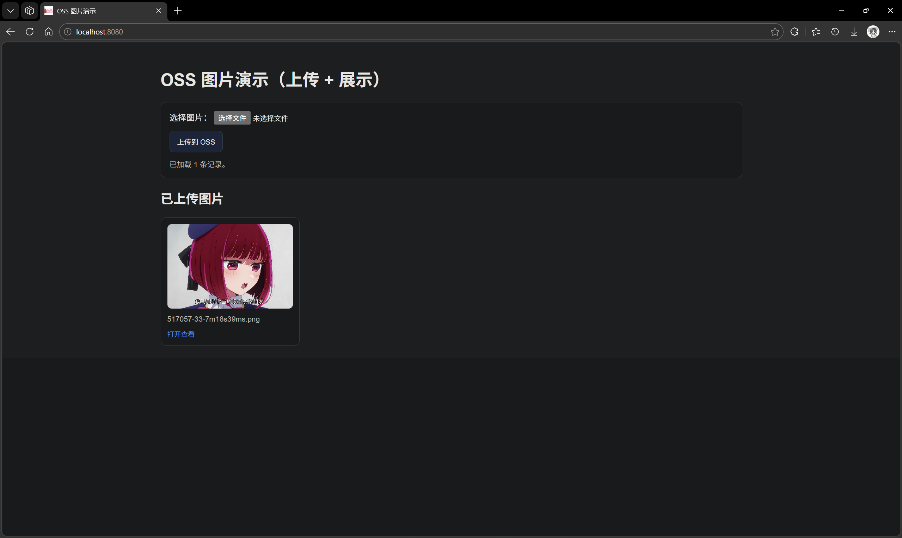

# aliyunOSS demo

Web 上传图片到阿里云 OSS，保存 fileName + ossUrl 到 MySQL，前端查询展示图片列表。

- 请先根据[applicantion-dev.yml.example](src/main/resources/application-dev.yml.example)修改你的配置信息并保存为application-dev.yml

- 利用[init.sql](src/main/resources/db/init.sql)进行数据库初始化
- 注意将OSS bucket设置为公共读
- 可以进行[上传和下载测试](src/test/java/com/wuminshi2/ossdemo/OsSdemoApplicationTests.java)来验证OSS配置情况
- 启动项目并访问 http://localhost:8080/  

实际效果如下图所示：
